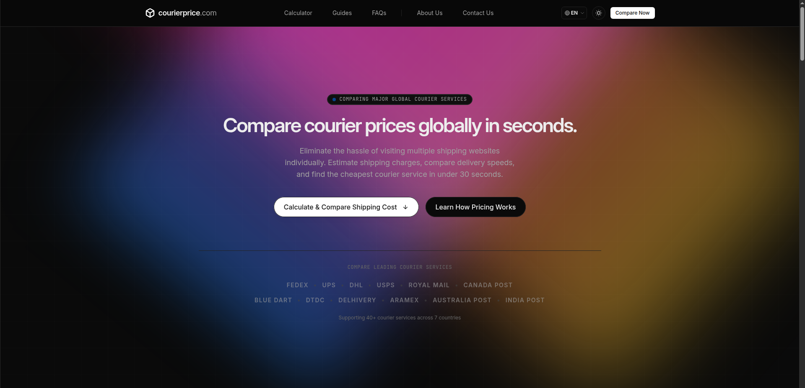
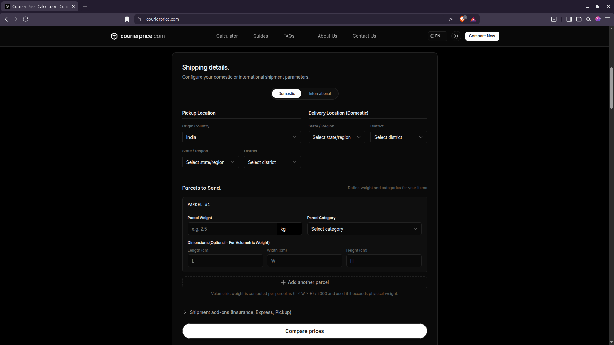
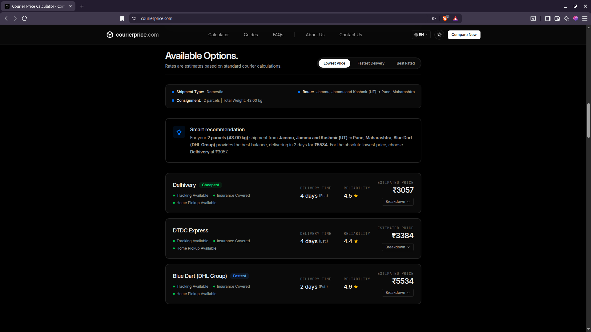
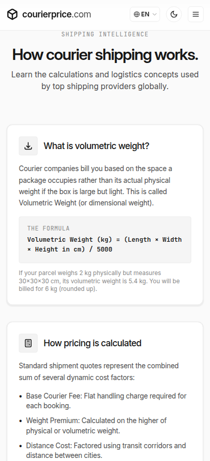
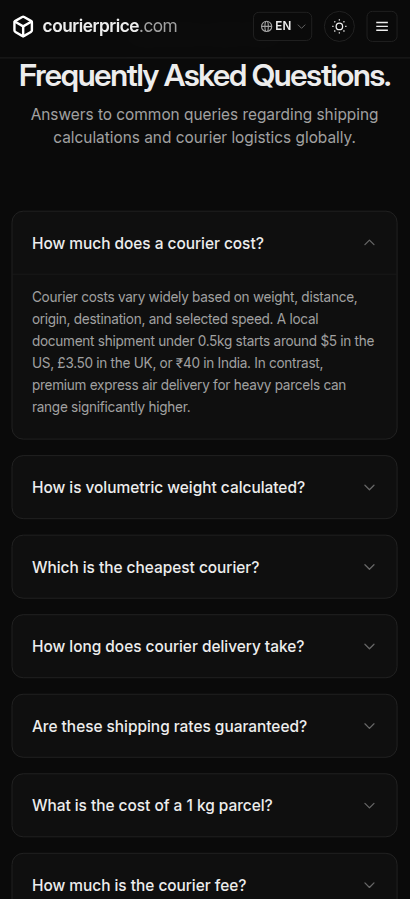

# CourierPrice

### Compare courier prices across multiple providers from a single, intuitive platform.

  

  
  
  
  

---

## 🖼️ Overview

Stop hopping between courier websites. Compare shipping prices from multiple providers in one place.

  <a href="https://github.com/user-attachments/assets/3702bad3-f12c-4e29-b1ba-2c948180f730">
    <strong>▶️ Watch the 22-Second Product Demo</strong>
  </a>

---

## 💡 Why I Built CourierPrice

Whenever I needed to compare courier prices, I found myself opening multiple courier websites, entering the same shipment details repeatedly, and manually comparing different pricing structures.

I wanted a faster and simpler workflow.

So I built **CourierPrice**, a tool that lets users enter shipment details once and instantly compare shipping prices across multiple courier providers.

---

## ✨ Features

- 🌍 Domestic & International shipping support
- 📍 Pickup & destination location selection
- 📦 Multiple parcel categories
- ⚖️ Weight & volumetric weight calculation
- 📐 Parcel dimension support
- 🚚 Home pickup option
- 🛡️ Shipping insurance
- ⚡ Express transit option
- 💰 Instant courier price comparison
- 📱 Fully responsive interface
- 🌙 Light & Dark mode

---

## 📸 Screenshots

### Calculator Interface

---

### Comparison Results

---

### Light Mode

---

### Mobile Friendly

---

## 🛠️ Tech Stack

- **Framework:** Astro
- **Language:** TypeScript
- **Styling:** Tailwind CSS
- **Deployment:** Cloudflare Pages

---

## 🌍 Supported Countries

Currently supports shipment estimation for:

- 🇮🇳 India
- 🇺🇸 United States
- 🇬🇧 United Kingdom
- 🇨🇦 Canada
- 🇦🇺 Australia
- 🇩🇪 Germany
- 🇦🇪 United Arab Emirates

More countries are planned.

---

## 🚀 Roadmap

- More courier providers
- Additional supported countries
- Delivery time comparison
- Courier recommendations
- Saved shipment history
- User accounts
- Shipment tracking

---

## 🌐 Live Website

**https://courierprice.com**

---

## 💬 Feedback

Suggestions, ideas, and feature requests are always welcome.

If you have feedback that could improve CourierPrice, I'd love to hear it.

---

### 👨‍💻 Built by Tushar Chib (BitSharc)

If you found this project useful, consider giving it a ⭐

